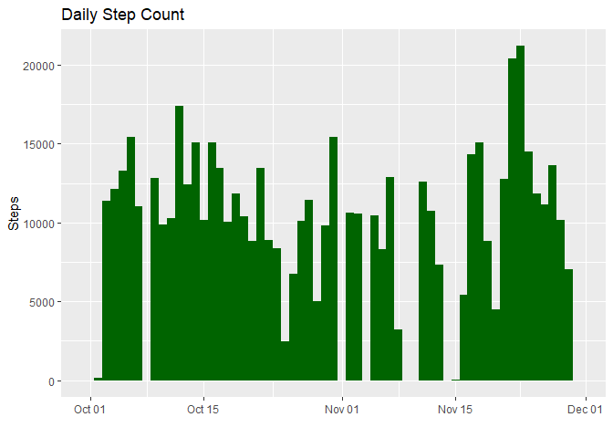
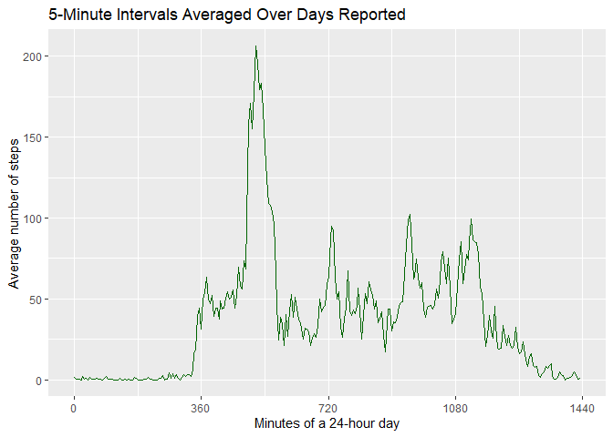
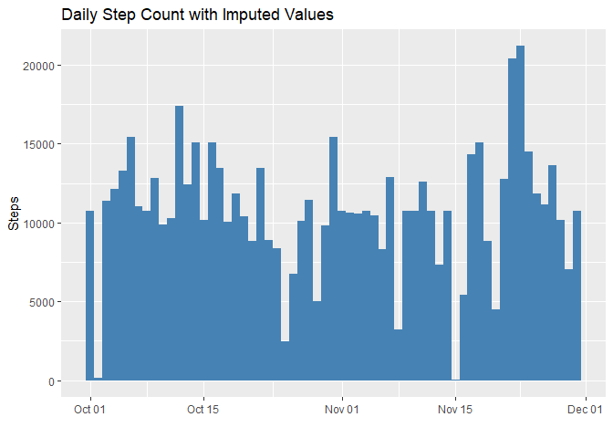
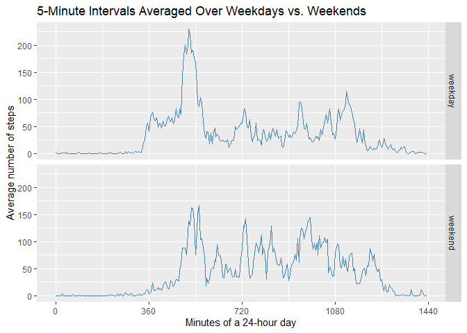

## Loading and preprocessing the data

Confirm the CSV file is present in the working directory. If it isn't, unzip the supplied file from the forked repository.


```r
FileName <- "activity.csv"
ZipFile <- "activity.zip"

# check for data file
if (!file.exists(FileName)) {
        # unzip data file
        unzip(ZipFile)
}
```

Load the source dataset.


```r
df1 <- read.csv(FileName)
```

Convert `date` to Date class.

Create `minute` from `interval`, where there are 1,440 minutes in a 24 hour day.


```r
# convert interval to a value in minutes
x <- df1$interval
# zero-buffer the front and coerce interval value to character
x <- paste0("000", x)
# grab the last 4 characters
x <- substring(x, nchar(x)-3)
# convert 4-character string of hhmm to minutes
x <- as.numeric(substr(x, 1, 2)) * 60 + as.numeric(substr(x, 3, 4))

df1 <- transform(df1, 
                 date = as.Date(as.character(date, "%Y-%m-%d")), 
                 minute = x)
```

Load the packages used in this assignment.


```r
library(ggplot2)
library(dplyr)
```

```
## 
## Attaching package: 'dplyr'
```

```
## The following objects are masked from 'package:stats':
## 
##     filter, lag
```

```
## The following objects are masked from 'package:base':
## 
##     intersect, setdiff, setequal, union
```


## What is mean total number of steps taken per day?


```r
# total number of steps taken per day
stepsDaySum <- df1 %>% 
        group_by(date) %>% 
        summarize(stepsSum = sum(steps))

# plot histogram; position and na.rm arguments are used to suppress related
# warnings
ggplot(stepsDaySum, aes(date, stepsSum)) + 
        geom_col(width = 1, fill = "darkgreen", 
                 position = "identity", na.rm = TRUE) + 
        labs(x = "", y = "Steps", title = "Daily Step Count")
```

<!-- -->

```r
# mean and median of the total number of steps taken per day
stepsSummary <- summary(stepsDaySum$stepsSum)
```

The total number of steps taken per day from October 01, 2012 to November 30, 2012, for the 53 days with data recorded, have a median of 10,765, and a mean of 10,766.19. The other 8 days during this period had no data recorded.


## What is the average daily activity pattern?


```r
# average number of steps for each 5-minute interval of the day
steps5minAvg <- df1 %>% 
        group_by(minute) %>% 
        summarize(stepsAvg = mean(steps, na.rm = TRUE), 
                  interval = unique(interval))

# plot time series
ggplot(steps5minAvg, aes(minute, stepsAvg)) + 
        geom_line(col = "darkgreen") + 
        scale_x_continuous(breaks = seq(0, 1440, 360)) + 
        labs(x = "Minutes of a 24-hour day", 
             y = "Average number of steps",
             title = "5-Minute Intervals Averaged Over Days Reported")
```

<!-- -->

```r
# identify the 5-minute interval with the most steps
steps5minMax <- subset(steps5minAvg, 
                       steps5minAvg$stepsAvg == max(steps5minAvg$stepsAvg))
```

The 5-minute interval, on average across all the days in the dataset, that contains the maximum number of steps is interval "835".

To interpret the `interval` variable, add zeros to front of the value to make it four digits long. In this case, that would be 0835. The first 2 digits represent the hour and the last 2 digits represent the minute.

In the above figure, the "835" interval is at the equivalent 515-minute mark - the high point on the figure above - with an average value of 206.2 steps.


## Imputing missing values

There are 2,304 missing values in the dataset.


```r
# list the dates with NAs and the frequency within each
naDays <- df1 %>% 
        filter(is.na(df1)) %>% 
        group_by(date) %>% 
        summarize(date = unique(date), countOfNAs = n())
# coerce from a tibble to a data frame for compatibility in later use
naDays <- as.data.frame(naDays)
naDays
```

```
##         date countOfNAs
## 1 2012-10-01        288
## 2 2012-10-08        288
## 3 2012-11-01        288
## 4 2012-11-04        288
## 5 2012-11-09        288
## 6 2012-11-10        288
## 7 2012-11-14        288
## 8 2012-11-30        288
```

Since the missing values are complete days - each day has 288 intervals of 5 minutes each - of missing data, it makes sense to impute values to each 5-minute interval based on the mean of the same interval as calculated from the other days.


```r
# copy the dataset
df2 <- df1

# update the missing data (NAs) with the mean of each corresponding interval
for (i in 1:nrow(naDays)) {
        df2[df2$date == naDays[i, "date"], "steps"] <- 
                steps5minAvg[, "stepsAvg"]
}
```

Missing values have been imputed.


```r
# with the imputed values...
# total number of steps taken per day
stepsDaySum2 <- df2 %>% 
        group_by(date) %>% 
        summarize(stepsSum = sum(steps))

# plot histogram; position and na.rm arguments are used to suppress related
# warnings
ggplot(stepsDaySum2, aes(date, stepsSum)) + 
        geom_col(width = 1, fill = "steelblue", 
                 position = "identity", na.rm = TRUE) + 
        labs(x = "", y = "Steps", 
             title = "Daily Step Count with Imputed Values")
```

<!-- -->

```r
# mean and median of the total number of steps taken per day, including imputed
# values
stepsSummary2 <- summary(stepsDaySum2$stepsSum)
```

The total number of steps taken per day, including imputed values, have a median of 10,766.19, and a mean of 10,766.19.

Since (1) we used the mean from the 5-minute intervals, and (2) there were 8 entire days where no steps were recorded, the median has changed, but the mean has not.

The impact of imputing missing data using this method has set 8 more days to the mean of the dataset, this, in turn, has resulted in a shift of the quantile cut points.

Before imputing.


```r
summary(stepsDaySum$stepsSum)
```

```
##    Min. 1st Qu.  Median    Mean 3rd Qu.    Max.    NA's 
##      41    8841   10765   10766   13294   21194       8
```

After imputing.


```r
summary(stepsDaySum2$stepsSum)
```

```
##    Min. 1st Qu.  Median    Mean 3rd Qu.    Max. 
##      41    9819   10766   10766   12811   21194
```


## Are there differences in activity patterns between weekdays and weekends?


```r
# add a factor variable that stores either "weekday" or weekend" based on the
# date
df2 <- df2 %>% 
        mutate(daytype = if_else(weekdays(date) %in% c("Sunday", "Saturday"), 
                                 "weekend", "weekday"))
df2$daytype <- as.factor(df2$daytype)

# average number of steps for each 5-minute interval on the weekdays and the
# weekends
steps5minAvg2 <- df2 %>% 
    group_by(daytype, minute) %>% 
    summarize(stepsAvg = mean(steps), 
              interval = unique(interval), 
              .groups = "drop_last")

# plot time series
ggplot(steps5minAvg2, aes(minute, stepsAvg)) + 
        geom_line(col = "steelblue") + 
        facet_grid(daytype ~ .) + 
        scale_x_continuous(breaks = seq(0, 1440, 360)) + 
        labs(x = "Minutes of a 24-hour day", 
             y = "Average number of steps",
             title = "5-Minute Intervals Averaged Over Weekdays vs. Weekends")
```

<!-- -->
